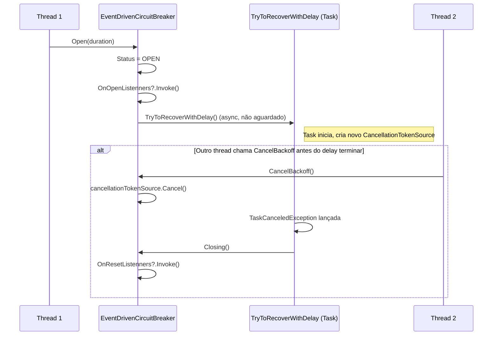
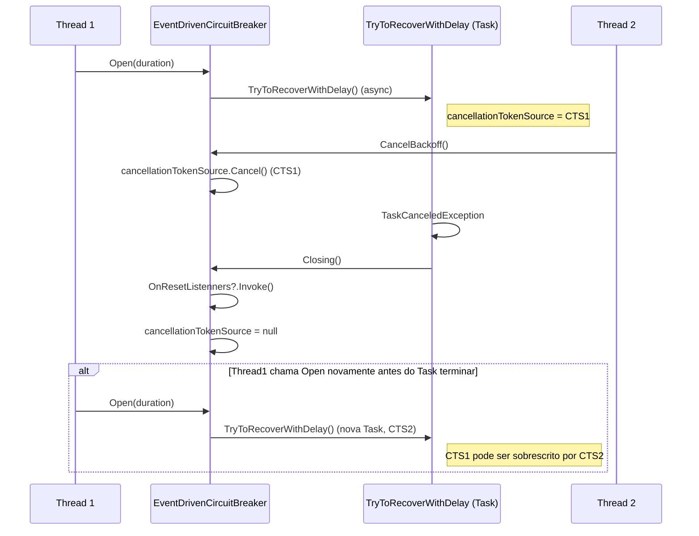
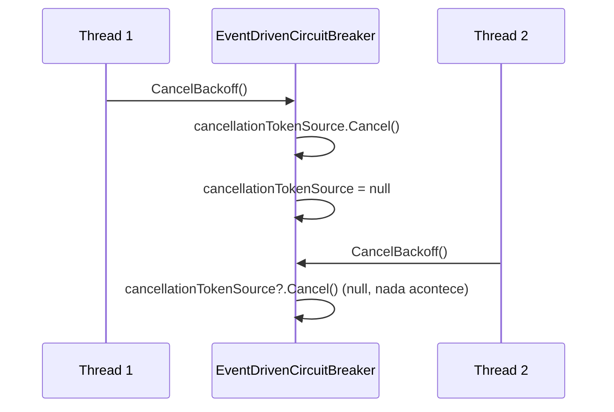
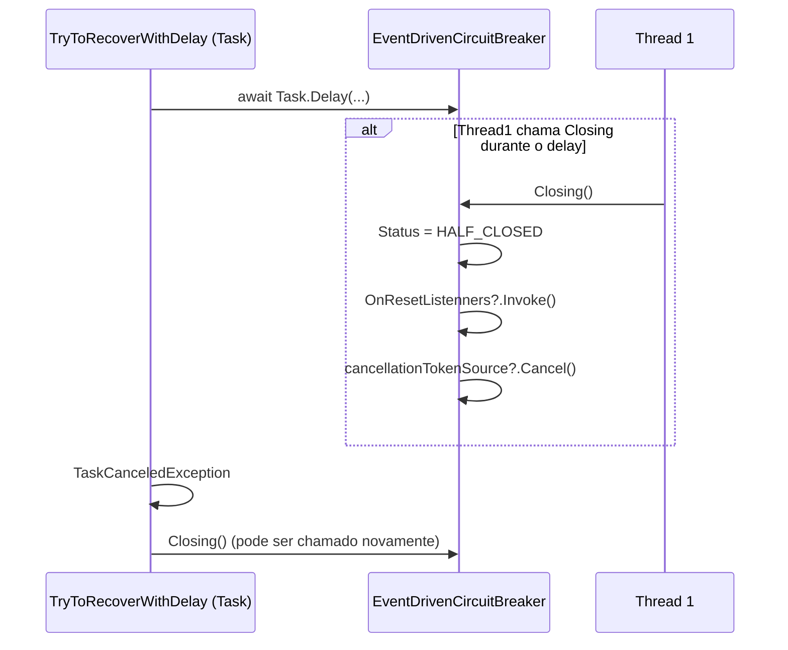

## Sequence Diagrams: Race Conditions in EventDrivenCircuitBreaker

A seguir estão diagramas de sequência que ilustram como as condições de corrida podem ocorrer devido à concorrência entre métodos públicos e a task assíncrona de recuperação (`TryToRecoverWithDelay`). Estes diagramas ajudam a visualizar como múltiplos pontos de entrada interagem com o estado interno e o `CancellationTokenSource`.

---

### 1. **Abertura do Circuito e Recuperação Assíncrona**

---

### 2. **Concorrência entre CancelBackoff e TryToRecoverWithDelay**

---

### 3. **Concorrência entre múltiplos CancelBackoff**

---

### 4. **Concorrência entre TryToRecoverWithDelay e Closing**

---

## **Resumo dos Riscos de Race Condition**

- **cancellationTokenSource** pode ser sobrescrito ou cancelado por múltiplos threads ou tasks concorrentes.
- **TryToRecoverWithDelay** pode ser iniciado múltiplas vezes sem aguardar a conclusão anterior, levando a múltiplos resets ou estados inconsistentes.
- **Métodos públicos** (`Open`, `CancelBackoff`, `Closing`) podem ser chamados em qualquer ordem e thread, concorrendo com a task assíncrona.

---

> **Sugestão:**  
> Para evitar estas condições de corrida, considere proteger o acesso ao `cancellationTokenSource` e ao estado do breaker com locks ou mecanismos de sincronização apropriados, e garantir que apenas uma task de recuperação possa estar ativa por vez.