# CircuitBreaker
Circuit breaker implements a circuit breaker that releafs the de developer from implementing complex logic.

It is a flexible implementation using BreakerStrategies and BackoffStrategies to provide multiple choices when implementing a breaker for your circuit.

To use this pattern, consider the following approach:

1. Create a BreakerStrategy passing a BreakerStrategy with a BackoffStrategy.
2. Wrap your code within one of the circuit breaker Wrap methods. Any exception thrown by the code will be considered a failure and will count for the breaker strategy. Normal completion of the code will count as a success. Exceptions
3. Set the OnOpen event listener to be notified when the circuit is open and take action.
4. Set the OnReset event listener to be notified when the circuit is reset and take action.

## CircuitBreaker in the configuration

## Circuit Breaker Workflows

### 1. BlockingCircuitBreaker with FailureThresholdStrategy

### 2. EventDrivenCircuitBreaker with FailureThresholdStrategy

```mermaid
flowchart TD
    A[Start Request] --> B{Is Circuit Open?}
    B -- Yes --> C[Throw OpenCircuitException]
    B -- No --> D[Execute Callback]
    D --> E{Exception Thrown?}
    E -- No --> F[Register Success]
    F --> G[Return Result]
    E -- Yes --> H{Is CircuitException?}
    H -- Yes --> I[Register Failure]
    H -- No --> J[Register Uncontrolled Failure]
    I --> K{Failure Threshold Reached?}
    J --> K
    K -- Yes --> L["`Open Circuit 
                    (Trigger OnOpen Event)`"]
    K -- No --> G
    L --> M[Start Backoff Timer]
    M --> N["´After Backoff, Try to Close 
            (Trigger OnReset Event)`"]
```

### 3. CircuitBreaker (Base) with FailureThresholdStrategy

> **Legend:**  
> - "CircuitException" refers to controlled exceptions (e.g., expected failures).  
> - "Uncontrolled Failure" refers to unexpected exceptions (e.g., runtime errors).  
> - "Backoff" is determined by the configured BackoffStrategy.

### Sequence Diagram: Successful Request

### Sequence Diagram: Failure and Circuit Opens

### Sequence Diagram: Circuit Half-Open and Recovery

